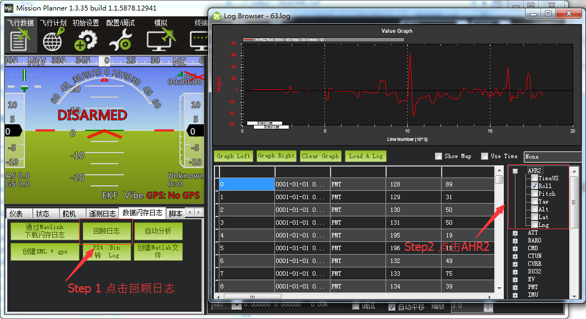
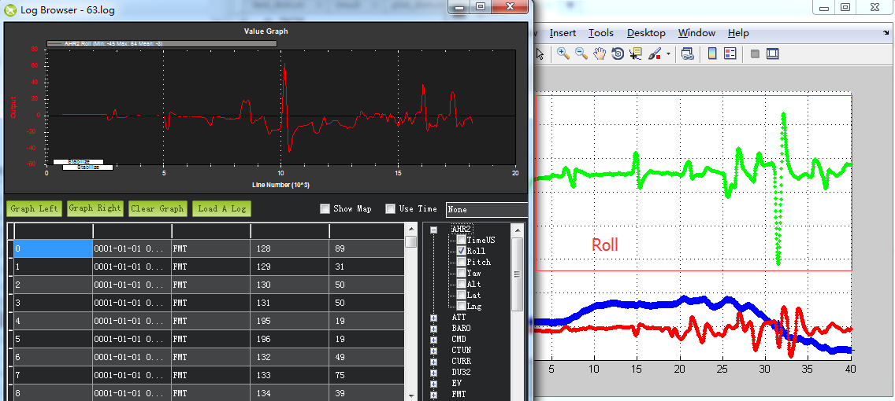

# DCM
这个工程是基于[starlino](http://www.starlino.com/dcm_tutorial.html)的DCM在matlab上的实现,为了更好在理解DCM算法的实现，感谢[dcm_tutorial](http://www.starlino.com/dcm_tutorial.html)评论区83楼Leonardo Garberoglio的原有想法。

其中imh.h为[原c语言](https://github.com/nephen/picquadcontroller/blob/master/imu.h)实现，飞行数据来源为sd卡，通过MP地面站转换，如下。

##怎么运行

1. 将DCM目录作为你的工作目录。
2. 运行test_dcm命令即可。
3. 通过修改ACC_WEIGHT加速度计的权重和MAG_WEIGHT磁力计的权重可以看到不同的姿态效果。

##效果分析
在MP地面站，可以对SD卡里在飞行数据进行图形分析，能看出飞控端DCM姿态解算的效果，如下：

然后根据这个去对比matlab解算的姿态效果，初略的如下：

改进版，在matlab里加入了飞控端的姿态效果：

