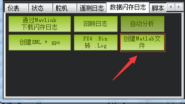

# DCM
这个工程是基于[starlino](http://www.starlino.com/dcm_tutorial.html)的DCM在matlab上的实现,为了更好在理解DCM算法的实现，感谢[dcm_tutorial](http://www.starlino.com/dcm_tutorial.html)评论区83楼Leonardo Garberoglio的原有想法。

其中imh.h为[原c语言](https://github.com/nephen/picquadcontroller/blob/master/imu.h)实现，飞行数据来源为sd卡，通过MP地面站转换，如下。

